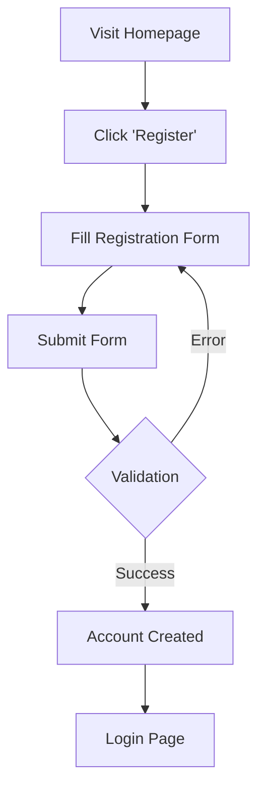
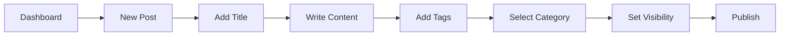

# Blog Management System - User Guide

## Table of Contents

1. [Getting Started](#getting-started)
    - [Registration](#registration)
    - [Login](#login)
2. [User Dashboard](#user-dashboard)
3. [Managing Your Profile](#managing-your-profile)
4. [Blog Posts](#blog-posts)
    - [Creating Posts](#creating-posts)
    - [Editing Posts](#editing-posts)
    - [Managing Visibility](#managing-visibility)
5. [Search Functionality](#search-functionality)
6. [Interacting with Content](#interacting-with-content)
    - [Comments](#comments)
    - [Likes](#likes)
    - [Bookmarks](#bookmarks)
7. [Categories and Tags](#categories-and-tags)
8. [Notifications](#notifications)
9. [User Roles and Permissions](#user-roles-and-permissions)

## Getting Started

### Registration

1. Visit the blog site homepage
2. Click on the 'Register' button
3. Fill in the registration form:
    - Username
    - Email address
    - Password (minimum 8 characters)
    - Confirm password
4. Click 'Register' to create your account

### Login

1. Navigate to the login page
2. Enter your registered email and password
3. Click 'Login'
4. Optional: Check 'Remember me' to stay logged in

## User Dashboard

After logging in, you'll be directed to your dashboard where you can:

-   View your recent posts
-   See notifications
-   Access quick links to create content
-   Manage your profile

## Managing Your Profile

1. Click on your profile picture in the top-right corner
2. Select 'Profile Settings'
3. You can update:
    - Profile picture
    - Username
    - Email address
    - Password
    - Bio
4. Click 'Save Changes' to update your profile

## Blog Posts

### Creating Posts

1. From your dashboard, click 'Create New Post'
2. Enter a title for your post
3. Write your content using the rich text editor
4. Add relevant tags
5. Select a category
6. Choose visibility (Public/Private)
7. Click 'Publish' or 'Save as Draft'

### Editing Posts

1. Go to your posts list
2. Click 'Edit' on the post you want to modify
3. Make your changes
4. Click 'Update' to save changes

### Managing Visibility

Posts can be set as:

-   Public: Visible to all users
-   Private: Visible only to you
-   Draft: Not published yet

## Interacting with Content

### Comments

1. Scroll to the comments section below any post
2. Write your comment
3. Click 'Post Comment'
4. You can:
    - Edit your comments
    - Delete your comments
    - Reply to other comments

### Likes

-   Click the heart icon to like/unlike a post
-   View who liked your posts

### Bookmarks

1. Click the bookmark icon on any post
2. Access your bookmarks from your dashboard
3. Remove bookmarks by clicking the icon again

## Categories and Tags

-   Browse posts by categories
-   Click on tags to find related content
-   Filter posts using multiple tags

## Notifications

You'll receive notifications for:

-   Comments on your posts
-   Replies to your comments
-   Likes on your posts
-   New followers

Access notifications by:

1. Clicking the bell icon
2. Marking notifications as read
3. Managing notification preferences

## User Roles and Permissions

### Regular Users Can:

-   Create and edit their own posts
-   Comment on posts
-   Like and bookmark content
-   Manage their profile

### Editors Can:

-   All regular user permissions
-   Edit any posts
-   Manage categories and tags

### Administrators Can:

-   All editor permissions
-   Manage user accounts
-   Configure site settings
-   Monitor site activity

## Search Functionality

The blog platform includes a powerful search system. For detailed information about using the search features, please refer to the [Search Guide](search_guide.md).

Key features include:

-   Search by keywords in titles and content
-   Filter by username
-   Search by tags
-   Combined search criteria

---

For technical support or questions, please contact the site administrator.

**Note**: This guide will be updated as new features are added to the platform.
